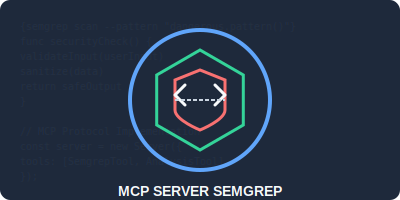

# MCP Server Semgrep



## O projekcie

Ten projekt został początkowo zainspirowany przez [stefanskiasan/semgrep-mcp-server](https://github.com/stefanskiasan/semgrep-mcp-server), ale ewoluował z istotnymi zmianami architektonicznymi, w tym własną implementacją protokołu MCP dla poprawy stabilności i łatwiejszej konserwacji.

MCP Server Semgrep to serwer zgodny z protokołem Model Context Protocol (MCP), który integruje narzędzie analizy statycznej Semgrep z asystentami AI, takimi jak Anthropic Claude. Umożliwia przeprowadzanie zaawansowanych analiz kodu bezpośrednio w interfejsie konwersacyjnym.

## Kluczowe ulepszenia

- Niestandardowa implementacja MCP upraszczająca bazę kodu
- Zmniejszona liczba zależności zewnętrznych dla lepszej konserwacji długoterminowej
- Usprawniony protokół komunikacji skoncentrowany na przypadkach użycia Semgrep
- Zreorganizowana struktura projektu i modularyzacja
- Ulepszona obsługa błędów i bezpieczeństwo
- Przejście na interfejs w języku angielskim
- Kompleksowe testy jednostkowe
- Rozbudowana dokumentacja

## Funkcje

Semgrep MCP Server zapewnia następujące narzędzia:

- **scan_directory**: Skanowanie kodu źródłowego pod kątem potencjalnych problemów
- **list_rules**: Wyświetlanie dostępnych reguł Semgrep
- **analyze_results**: Szczegółowa analiza wyników skanowania
- **create_rule**: Tworzenie niestandardowych reguł Semgrep
- **filter_results**: Filtrowanie wyników według różnych kryteriów
- **export_results**: Eksportowanie wyników w różnych formatach
- **compare_results**: Porównywanie dwóch zestawów wyników

## Instalacja

### Wymagania wstępne

- Node.js v16+
- Semgrep CLI zainstalowany globalnie lub lokalnie
- TypeScript (dla rozwoju)

### Konfiguracja

1. Sklonuj repozytorium:
```bash
git clone https://github.com/yourusername/mcp-server-semgrep.git
cd mcp-server-semgrep
```

2. Zainstaluj zależności:
```bash
npm install
# lub
yarn install
# lub
pnpm install
```

3. Zbuduj projekt:
```bash
npm run build
# lub
yarn build
# lub
pnpm run build
```

## Integracja z Claude Desktop

Aby zintegrować MCP Server Semgrep z Claude Desktop:

1. Zainstaluj Claude Desktop
2. Zaktualizuj plik konfiguracyjny Claude Desktop (`claude_desktop_config.json`):

```json
{
  "mcpServers": {
    "semgrep": {
      "command": "node",
      "args": [
        "/ścieżka/do/projektu/mcp-server-semgrep/build/index.js"
      ]
    }
  }
}
```

3. Uruchom Claude Desktop i zacznij zadawać pytania dotyczące analizy kodu!

## Przykłady użycia

### Skanowanie projektu

```
Mógłbyś przeskanować mój kod źródłowy w katalogu /projekty/moja-aplikacja pod kątem potencjalnych problemów bezpieczeństwa?
```

### Tworzenie niestandardowej reguły

```
Stwórz regułę Semgrep, która wykrywa nieprawidłowe użycie funkcji sanitizujących dane wejściowe.
```

### Filtrowanie wyników

```
Pokaż mi tylko wyniki skanowania dotyczące podatności na wstrzykiwanie SQL.
```

## Rozwój

### Testy

```bash
npm test
# lub
yarn test
# lub
pnpm test
```

### Struktura projektu

```
src/
  ├── config.ts         # Konfiguracja serwera
  ├── index.ts          # Punkt wejścia
  ├── sdk.ts            # Most dla protokołu MCP
  ├── mcp/              # Własna implementacja MCP
  ├── handlers/         # Procedury obsługi zapytań
  ├── utils/            # Funkcje narzędziowe
  └── types/            # Definicje typów TypeScript
```

## Licencja

Ten projekt jest licencjonowany na warunkach licencji MIT - zobacz plik [LICENSE](LICENSE) dla szczegółów.

## Podziękowania

- [stefanskiasan](https://github.com/stefanskiasan) za oryginalną inspirację
- [Anthropic](https://www.anthropic.com/) za Claude i protokół MCP
- [Semgrep](https://semgrep.dev/) za ich świetne narzędzie do analizy statycznej
